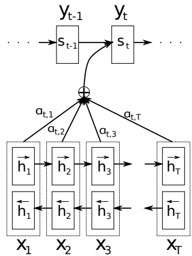
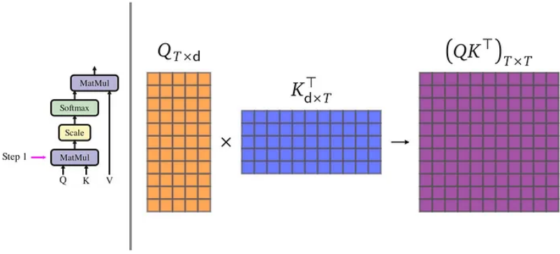
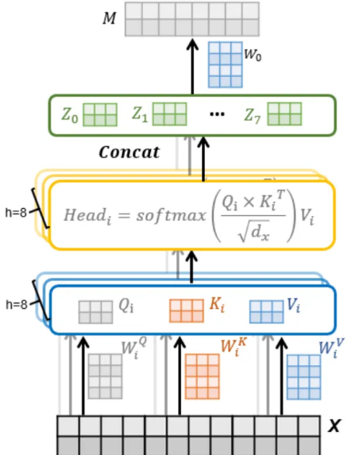
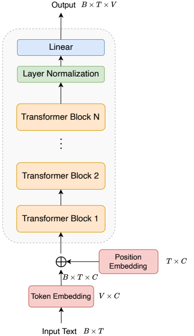
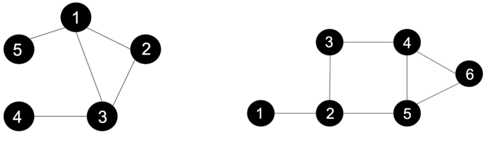

# Assignment 2. Properties of CNNs, LLM Training, Graph Neural Networks

University of Amsterdam – Deep Learning Course 1

November 11, 2024

#### The deadline for this assignment is December 1st, 2024.

### 1 Properties of CNNs (Total: 22 points)

While standard Multilayer Perceptrons (MLPs) can deliver reasonable performance on certain tasks as seen in the previous assignment, they are not as scalable as eventually needed in practice. The disadvantage is that the number of total parameters can grow very quickly, especially when having high dimensional inputs like images. This is inefficient because there is redundancy in such high dimensions. To address the issue, Convolutional Neural Networks (CNNs) have been proposed. They can exploit the rich intrinsic structure of the images, using a shared set of weights at each layer, making them more efficient than MLPs.

In this part, we will look into what gives CNNs these properties. As the name suggests, CNNs involve the "convolution" operation. This can be denoted with ∗ which modifies each pixel in image with respect to its neighboring pixels, using a second image ℎ, resulting in a third image :

$$f(x,y)=(g*h)(x,y)=\Sigma_{m}\Sigma_{n}g(x-m,y-n)h(m,n)$$

Intuitively, the convolution "spreads" each pixel (, ) in following ℎ and proportionally to the intensity (, ).

| f1,1 f1,2 f1,3 f1,4 f1,5 | 91,1 | 91,2 91,3 | 91,4 | 91,5 |  | -1 0 +1 |  |
| --- | --- | --- | --- | --- | --- | --- | --- |
| f2,1 f2,2 f2,3 2,4 f2,5 | 92,1 | 92,2 92,3 | 92,4 | 92,5 |  | h _, _ h _, 0 h -, + | ー1 |
| f3,1 f3,2 f3,3 f3,4 f3,5 | = 93,1 | 93,2 93,3 | 93,4 | 93,5 | 来 | ho .- ho.o ho .+ | 0 |
| f4,1 f4,2 f4,3 f4,4 f4,5 | 94.1 |  | 94,2 94,3 94,4 94,5 |  |  | h + . - h + . 0 h + . + | +1 |
| f5,1 | 55.2 f5,3 |5,4 |5,5 | 95,1 | 95,2 95,3 | 95,4 | 95,5 |  |  |  |

Figure 1. Computation of convolution for pixel location (2,2) of image .

#### Question 1.1 (10 points)

Run the code provided in Assignment 2 part1/ques1 directory as per the instructions given in the README.md and the question description below to answer the following:

(a) (1 point) What is the expression of 1,1 according to the above Figure 1? What do you think is missing and how can we mitigate this problem?

(b) i. (1 point) Run the given code with net_type='Net1', and vary different conv_type from 'valid', 'replicate', 'reflect', 'circular', 'sconv' and 'fconv', and report the validation and test scores in the form of a table.

ii. (1 point) Look at the data samples from the train and test sets provided in the README.md. Based on the structure of the images, guess the pattern of class label 0 and class label 1. How do the samples in the train set differ from the ones in the test set?

(c) i. (1 point) From the network architecture of 'Net1', infer the variables that affect the conv_type. What is the difference between conv_type 'valid', 'sconv' and 'fconv'?

ii. (1 point) Why do the test accuracies of conv_type='valid', 'sconv' and 'fconv' (i.e., acc_valid, acc_sconv and acc_fconv) follow the order – acc_valid < acc_sconv < acc_fconv?

Hint: Pay attention to the 'kernel_size' and 'stride' used in the Conv2D layers. iii. (1 point) Why is the test accuracy of conv_type='reflect' less than 'fconv'? iv. (1 point) Why is the test accuracy of conv_type='replicate' more than 'fconv'?

(d) i. (1 point) Run the given code with net_type='Net2', and vary different conv_type from 'valid', 'replicate', 'reflect', 'circular', 'sconv' and 'fconv', and report the validation and test scores in the form of a table.

ii. (1 point) Do the test accuracies for each of the conv_types in net_type='Net2' increase or decrease w.r.t their corresponding conv_type counterparts in 'Net1'?

iii. (1 point) State the reason behind this change in test accuracies.

### Question 1.2 (12 points)

Fill the missing parts in exercise1.2.ipynb. Submit the file, and upload your answers to this questions to ANS.

(a) (5 points) Plot the accuracy of the model during inference respect to the angle of rotation of test images and include the figure in your answers. What can you conclude about rotational invariance of CNNs from the plot? Explain why are there larger accuracy at certain degrees.

(b) (7 points) Train a new model like the previous one but adding rotational augmentation to its datasets, and plot its accuracy during inference with respect to the angle of rotation of the test images. Include the figure in your answers. Describe the differences observed compared to the plot in Question 1.2(a) and explain the reasons for these differences.

### 2 Attention, Transformers, and LLMs (Total: 56 points)

The evolution of sequence-to-sequence modeling in deep learning represents one of the most significant advances in artificial intelligence. Initially, Recurrent Neural Networks (RNNs) were the standard approach for handling sequential data. However, RNNs faced fundamental limitations: they processed sequences sequentially, making parallel computation impossible, and struggled to capture long-range dependencies due to vanishing gradients.

A breakthrough came in 2014 when [1] introduced the attention mechanism for neural machine translation, also known as global attention. This innovation allowed models to dynamically focus on relevant parts of the input sequence, rather than compressing all information into a fixed-length vector. The success of attention in RNN-based models led to increasing interest in attention mechanisms over the following years. The watershed moment arrived in 2017 with [2], which introduced the Transformer architecture. This paper demonstrated that self-attention alone, without any recurrence or convolution, could achieve state-of-the-art results in machine translation. The impact was revolutionary: Transformers now form the foundation of most state-of-the-art models in different tasks, from language processing [3, 4] to computer vision (ViT) [5]. The versatility of Transformers extends far beyond single-modality tasks. A striking example is [6], which demonstrated how Transformer-based architectures could bridge the gap between vision and language. By training a vision encoder for images and a text encoder for captions, CLIP showed that transformers could learn rich, aligned representations across different modalities. A lit bit later the transformer architecture also enabled impressive text-toimage generation, like in DALL-E [7], and started to be used in generative AI.

In this assignment, you will build your own miniature version of GPT (Generative Pre-Trained Transformer) [3], and train it on small dataset. Starting with the fundamental building blocks of Transformers, you will progressively combine them into a complete language model capable of generating coherent text. Through this hands-on implementation, you will gain deep insights into the architecture used by millions of people every day and which has changed the way we search for answers in all kinds of problems. Before diving into the implementation, we will first delve into the theoretical foundation of attention, how it was historically derived in sequence-to-sequence models, and then move on to the attention mechanism that revolutionized sequence modeling.

### 2.1 Attention for Sequence-to-Sequence models

Conventional sequence-to-sequence models for neural machine translation have difficulty to handle long-term dependencies of words in sentences. In such models, the neural network is compressing all the necessary information of a source sentence into a fixed-length vector. Attention, as introduced by [1], emerged as a potential solution to this problem. Intuitively, it allows the model to focus on relevant parts of the input, while decoding the output, instead of compressing everything into one fixed-length context vector. The attention mechanism is shown in Figure 2. The complete model comprises an encoder, a decoder, and an attention layer.

Unlike conventional sequence-to-sequence, here the conditional probability of generating the next word in the sequence is conditioned on a distinct context vector for each target word . In particular, the conditional probability of the decoder is defined as:

$$p(y_{i}|y_{1},\ldots,y_{i-1},x_{1},\ldots,x_{T})=p(y_{i}|y_{i-1},s_{i}),\tag{1}$$

where is the RNN decoder hidden state for time i computed as = (−1, −1, ).

The context vector depends on a sequence of annotations (ℎ1, . . . , ℎ ) to which an encoder maps the input sentence; it is computed as a weighted sum of these annotations

Figure 2. The graphical illustration of the attention mechanism proposed in [1]

ℎ :

$$c_{i}=\sum_{j=1}^{T_{x}}\alpha_{ij}h_{j}.\tag{2}$$

The weight of each annotation ℎ is computed by

$$\alpha_{ij}=\frac{\exp\left(e_{ij}\right)}{\sum_{k=1}^{T_{x}}\exp\left(e_{ik}\right)},\tag{3}$$

where = (−1, ℎ) is an alignment model which scores how well the inputs around position and the output at position match. The score is based on the RNN hidden state −1 (just before emitting , Eq. (1)) and the -th annotation ℎ of the input sentence. The alignment model is parametrized as a feed-forward neural network which is jointly trained with all the other components of the proposed system. Use the Figure 2 to understand the introduced notations and the derivation of the equations above.

### 2.2 Causal Self-Attention

While the original Transformer architecture employed both an encoder and decoder, many modern Large Language Models (LLMs) such as GPT use a decoder-only architecture. This design choice emphasizes the auto-regressive nature of language-modeling, where each token attends to previous tokens in the sequence. The Transformer architecture in [2] is the first encoder-decoder model based solely on (self-)attention mechanisms, without using recurrence and convolutions. Specifically the authors of the Transformer paper redefined the attention mechanism by providing a generic definition based on queries, keys, values. The encoded representation of the input is viewed as a set of key-value pairs, of input sequence length. The previously generated output in the decoder is denoted as a query. In this and the following sub-sections we go over the key concepts for understanding Transformers.

Single-Head Attention The foundation of the transformer is the attention mechanism. In its simplest form, attention operates by computing compatibility scores between a query and all available keys, then using these scores to create a weighted sum of values. The attention score of all queries Q with all keys K is computed as:

Attention(Q,K,V)=softmax($\frac{\text{QK}^{T}}{\sqrt{d_{k}}}$)V (4)

The input consists of queries and keys of dimension , and values of dimension . The attention operation can be broken down into four key steps:

- 1. Query-Key Similarity: Compute dot products between queries and keys to determine how much each token should attend to others. √
- 2. Scaling: Divide by .
- 3. Masking and Softmax: Apply causal masking and normalize scores using softmax.
- 4. Aggregation: Use normalized scores to compute weighted sum of values.

Notice that the dot product of the query with all keys represents a matching score between the two representations.

Fig. 3 provides a nice illustration of the vectorized scaled-dot mechanism.

Figure 3. Scaled Dot-Product Attention mechanism. Q, K, and V represent queries, keys, and values respectively. The output is a weighted sum of values, where weights are determined by compatibility between queries and keys.

Multi-Head Attention Rather than performing attention once, Transformers use multiple attention heads operating in parallel. That is because it is beneficial to linearly project the Q, K and V, h (number of head) times with different, learned linear projections

Figure 4. Illustration of Multi-Head Attention Mechanism. Each input x is processed to generate query, key, and value vectors, which are then divided into multiple heads (in this case, ℎ = 8 heads). Each head computes attention independently, and the results are concatenated before being linearly transformed to produce the final output.

to , and dimensions, respectively. The outputs are concatenated and once again projected by an output layer:

MultiHead(, , ) = Concat(head1, ..., headh) , where headi = Attention( , , ).

Fig.4 breaks down the operation taking place in the Multi-Head Attention layer. The idea behind multi-head attention in Transformers is to allow the model to capture diverse relationships in language by simultaneously looking at input sequences from multiple perspectives.

Hierarchy of Attention Mechanisms The relationship between self-attention, multihead attention, and scaled dot-product attention represents a hierarchical structure where each mechanism builds upon the others. Let's break down their relationships and connections:

1. Scaled Dot-Product Attention This is the fundamental computational block that forms the basis for all attention mechanisms: It takes three inputs (queries, keys, values) and produces weighted combinations of values based on query-key compatibility scores.

2. Multi-Head Attention Multi-head attention uses multiple instances of scaled dotproduct attention in parallel: Each head performs its own scaled dot-product attention on linearly projected versions of the inputs.

3. Self-Attention Self-attention is a specific application where the queries, keys, and values all come from the same source.

### The Connection Flow

#### 1. From Input to Self-Attention

- A sequence is processed to create , , and matrices
- These matrices represent the same sequence from different perspectives
- This is the "self" aspect of self-attention

#### 2. From Self-Attention to Multi-Head

- The , , matrices are linearly projected ℎ times
- Each projection creates inputs for a separate attention head
- This allows the model to attend to different aspects of the sequence

### 3. From Multi-Head to Scaled Dot-Product

- Each head independently computes attention using the scaled dot-product mechanism √
- The scaling factor prevents gradient issues
- Results from all heads are concatenated and projected to the final output

#### Question 2.1 (10 points)

- (a) Discuss the computational challenges that arise in Transformer models when handling long input sequences. Your response should:
(a) Briefly describe why long sequences are challenging for Transformers.

- (b) Suggest a method to address this challenge.
- Word limit: 200 words. (4 points)
- (b) Discuss the receptive field of Transformer and Convolutional Neural Networks (CNNs), and their capability to capture long-range dependencies. (2 points) √
- (c) Explain why the scaling factor is used in the self-attention mechanism (refer to Eq. (4)). Describe its effect on the computation of attention scores. (2 points)
- (d) Explain the advantages of using multiple attention heads compared to a single attention mechanism with the same total computational cost. (2 points)

#### Question 2.2 (8 points)

- (a) Fill the missing parts of gpt.py. Complete the forward function in the CausalSelfAttention class. At this stage, you can leave the placeholder for use_flash_attn as is. For sequential prediction, ensure the mask is constructed so that the Transformer does not attend to future tokens.
### 2.3 The Transformer Block

In the preceding sections we describe the idea of the self-attention mechanism. However, normal Transformer blocks include additional components which we tackle here.

Layer Normalization Layer normalization helps stabilize training by normalizing the inputs across each layer, reducing internal covariate shift. This improves training speed, enables deeper networks, and helps the model handle varying input scales effectively, which is crucial for attention mechanisms that rely on scaled dot-product computations.

Specifically, in the case of GPT, a LayerNorm is applied in each Decoder block both before causal self-attention, after it, and at the end, before the language modelling head. One drawback of LayerNorm is that it requires computing both the expected value and the standard deviation. An alternative normalization technique is RMSNorm, which instead normalizes by the L2 norm across channels. This way of normalization is slightly more computationally efficient, and is applied in the Llama family of models. In this assignment, you are to implement and use RMSNorm.

$$\mathrm{RMSNorm}(x)={\frac{x}{\sqrt{{\frac{1}{d}}(\sum_{i=1}^{d}x_{i}^{2})+\epsilon}}}\cdot\gamma$$

where: is the input tensor, is the dimension of , is a small constant added for numerical stability, and is a learned scaling parameter (the weight).

Feed-forward Module (MLP) Following layer normalization, we also apply a feedforward layer in order to allow the module to additionally learn useful non-linear transformations for the embedding vectors. The feed-forward module, or Multi-Layer Perceptron (MLP), plays a distinct and complementary role to the Multi-Head Attention (MHA) block. While the MHA enables communication between tokens through attention mechanisms, the MLP operates independently on each token, applying the same transformation to each position separately. This independent processing serves several crucial purposes:

#### 1. Token-wise Feature Enrichment:

- Each token's representation is individually enhanced through non-linear transformations
- No cross-token communication occurs, focusing purely on feature extraction within each token's context
- This allows the model to capture complex patterns specific to each token's position and context

#### 2. Architecture:

- Typically implemented with two linear layers and a non-linear activation function
- The hidden dimension is usually larger than the model dimension (e.g. ×4)
- This expansion and contraction allows for richer feature extraction

The combination of MHA (for token communication) and MLP (for independent token processing) creates a powerful mechanism for both capturing relationships between tokens and enriching individual token representations.

Dropout Dropout is a crucial regularization technique used throughout the Transformer architecture to prevent overfitting and improve generalization. In Transformers, dropout is applied at several key locations:

#### 1. Attention Dropout:

- Applied to the attention weights after softmax
- Randomly zeros out attention connections during training
- Prevents the model from over-relying on specific attention patterns

### 2. Residual Dropout:

- Applied to the output of each sub-layer before it's added to the residual connection
- Helps maintain the stability of the residual connections
- Typically applied after both the self-attention and feed-forward layers

### 3. Input Embedding Dropout:

- Applied to the sum of token and positional embeddings
- Encourages the model to use all input features rather than depending on specific embedding dimensions
- Helps prevent over-fitting to specific input patterns

During inference, dropout is disabled, and the model uses the full network. The dropout rate is a hyperparameter that typically ranges from 0.1 to 0.3 in Transformer models, with larger models often using higher dropout rates to counter their increased capacity for over-fitting.

### Question 2.3 (8 points)

- (a) Complete the RMSNorm class. (2 points)
- (b) Integrate the necessary modules to construct a Transformer block within the TransformerDecoderBlock class. (4 points)
- (c) Why is the MLP wide and not deep? (2 points)

### 2.4 Constructing an LLM

Building a complete LLM like GPT (Fig. 5) requires several components: a tokenizer (constructed from the dataset's vocabulary), positional embeddings, a stack of transformer blocks, and a final output linear layer.

Vocabulary The choice of vocabulary, or rather, a tokenization technique, can significantly impact the quality of the generations. Consider a model trained only with the 128 usable ASCII characters. This model will be severely limited in terms of its expressivity, and will (paradoxically) require more parameters to reach similar capability, as one, for example, trained with some 12,800 words available in the corpus. However, we cannot simply use whole words to train the model. What if there are unique names? What if the text contains typos, are these different words? What if we want to build a multilingual model, and so on? There are many tokenization algorithms and often each model has its own tokenizer. In this case, we ask that you train the model using a simple character-level tokenizer. However, it's worth noting that the Byte-Pair Encoding (BPE) tokenizer used in the original GPT paper is a more advanced choice. BPE operates on sequences of Unicode bytes, allowing it to capture a broad range of words in the corpus and beyond. While we won't go into detail about the tokenizer choice here, it's essential to strike a balance between vocabulary size and expressive power, trading off computational efficiency for expressiveness.

Hidden Dimensionality The number of hidden dimensions, often referred to as or C, is both the size of the feature vectors for each word, and the size of each head in the matrix. The dimensionality is key for the expressive power of the model – but it also controls the size of your model. Higher dimensionality will likely yield a better model, but will consequently result in bigger model. Thus, the choice of this hyperparameter is essential1 .

Position Embeddings For training a transformer on the text data, we need to consider the positional relationship between tokens. A common practice is using the absolute position embedding as introduced in Tutorial 6. In GPT-2, learnable positional embeddings are used to provide the model with information about the position of each token within a sequence. Since transformers are inherently permutation-invariant (they do not naturally

1Modern LLMs predominantly use powers of 2 or multiples of 256. This NVIDIA blog elaborates why.

Figure 5. The decoder architecture of GPT2 model [3]. is the batch size, is the number of tokens, is the vocabulary size of the dataset, and is the feature dimension of each token.

process input tokens in a specific order), positional embeddings are essential to retain the sequential structure of the input text.

The positional embeddings are represented as a learnable matrix with dimensions matching the token embedding dimension . Specifically, the matrix has a shape of × , where is the maximum sequence length (or number of positions in a sequence) and is the dimensionality of each embedding vector (matching the token embedding dimension). Each position in the sequence has a unique embedding that is added to the corresponding token embedding before being passed into the transformer blocks.

#### Question 2.4 (5 points)

- (a) What happens if we do not make use of any positional embeddings? (2 points)
- (b) Discuss the limitations of absolute position embeddings in large language models (LLMs) and the advantages of using relative position embeddings in Transformer models. (3 points)

GPT Decoder Given a batch of sentences, we begin by using a tokenizer to encode each sentence into tokens, resulting in a tensor of shape × , where is the batch size and is the fixed sequence length (number of tokens per sentence). Each token is represented by an index in the vocabulary, which is used to retrieve its high-dimensional embedding from a learnable token embedding layer. This embedding layer has dimensions × , where is the vocabulary size and is the embedding dimension.

The token embeddings are then combined with learnable positional embeddings to retain sequential information. This combined input is passed through a sequence of Transformer blocks as detailed in Section 2.3. Following that, the we apply a final layer normalization and a linear transformation, yielding a prediction tensor of shape × ×. Applying the softmax operation to this output generates the probability distribution over the vocabulary for each position, representing the likelihood of each token as the next in the sequence.

#### Question 2.5 (4 points)

- (a) Complete the forward function of the GPT class. In this stage, you are supposed to use config.abs_emb as True. (4 points)
### 2.5 Relative Position Embeddings

In the previous section, we used a learnable positional embedding, a type of absolute embedding that has several limitations (see Question 4). Relative positional embeddings, in contrast, have been widely adopted in large language models (LLMs) like Llama and certain GPT variants. They emphasize the distance between tokens, enabling the model to capture patterns based on relative proximity rather than fixed locations. This approach is particularly advantageous for tasks like language modeling and document classification, where dependencies often span across different parts of the text. By focusing on distances rather than fixed positions, relative positional embeddings also allow transformer models to generalize more effectively to longer sequences than those seen during training.

#### 2.5.1 Rotary Position Embeddings

RoPE embeddings are one of the most representative relative position embeddings. These embeddings encode positional information through rotation matrices. The core idea of RoPE is to achieve relative position encoding by applying absolute positional encoding to the query and key vectors in the attention mechanism. This approach combines the benefits of both absolute and relative positional encoding. By injecting absolute positional information into the and vectors, their inner product in the attention calculation naturally introduces relative positional information, enhancing the model's ability to capture relationships based on token distance while retaining absolute positional context. For further details, please refer to the original paper [8]. Here, we outline a straightforward implementation approach. A more efficient method leverages complex numbers for computational efficiency.

For a pair of dimensions, the position-dependent rotation is defined as:

$$R_{\theta}={\begin{bmatrix}\cos(\theta)&-\sin(\theta)\\ \sin(\theta)&\cos(\theta)\end{bmatrix}}$$

This matrix will be applied to each pair of dimensions to encode positional information. For each pair of dimensions (2, 2 + 1) in the embedding vector, calculate a frequency parameter as:

$$\omega_{i}={\frac{1}{10000^{2i/d}}}$$

where is the dimensionality of the embedding, and ranges from 0 to 2 −1.

This frequency scales the angle differently across the embedding dimensions, allowing the model to represent multiple positional frequencies. For a given position and frequency , calculate the position-dependent angle , as:

$$\theta_{m,i}=m\cdot\omega_{i}$$

where is the token's position in the sequence.

For each vector x at position , apply the rotation to each dimension pair (2, 2 + 1) as follows:

$$\begin{bmatrix}x^{\prime}_{2i}\\ x^{\prime}_{2i+1}\end{bmatrix}=\begin{bmatrix}\cos(m\cdot\omega_{i})&-\sin(m\cdot\omega_{i})\\ \sin(m\cdot\omega_{i})&\cos(m\cdot\omega_{i})\end{bmatrix}\begin{bmatrix}x_{2i}\\ x_{2i+1}\end{bmatrix}$$

for the components of $x$ at the respective time 

where 2 and 2+1 are the components of x at the respective dimensions.

The position-based attention between a query vector at position and a key vector at position is given by:

Attention(, ) = ⟨RoPE(, ), RoPE(, )⟩.

### Question 2.6 (5 points)

(a) In the file gpt.py, complete the apply_rotary_emb function in the CausalSelfAttention class. Note that the frequency is given by self.inv_freq. You will need to implement sinusoidal embedding components (rotation transformations) based on the frequency and apply the rotary position embedding transformation.

### 2.6 Training

Modern LLM training comprises a lot of moving parts, however, the most basic components are pre-training – a self-supervised training on a massive scale often on a lower quality dataset2 – and fine-tuning for specific downstream tasks – question-answering, instruction-following, chain of thought decision-making, and so on.

### 2.6.1 Pre-training

Pre-training is the initial stage where models learn language patterns and general knowledge from vast corpora. Using self-supervised objectives like masked language modeling (e.g., BERT) or causal language modeling (e.g., GPT), the model learns to predict missing or next tokens within sequences. This phase typically involves large, diverse datasets, often requiring substantial filtering to manage quality and biases. Due to the scale of data and model size, pre-training demands extensive computational resources, spanning weeks or even months on large GPU or TPU clusters.

### Question 2.7 (4 points)

Train the LLM for 5 epochs on the "Fairy Tales by Brothers Grimm" corpus with the default parameters provided in cfg.py and provide training loss curves (you can use screenshots from Tensorboard).

Note: We recommend also going through the following Section 2.8 to implement optimizations. With all available optimizations, it should take around 20-30 minutes on a single A100.

### 2.6.2 Fine-tuning

Fine-tuning adjusts the pre-trained model to excel in specific tasks by training on smaller, high-quality labeled datasets. This can include supervised learning for applications like summarization or instruction-following, often enhanced by methods such as reinforcement learning from human feedback (RLHF) to align model responses with user expectations. Fine-tuning boosts task-specific performance, though care is needed to prevent overfitting, which can limit the model's generalizability across other tasks.

## 2.7 Generation

We trained our model in a self-supervised, autoregressive objective of next token prediction. Now what? The most basic thing we can do is to use it according to what it was trained for – to predict the next token in a sequence.

2The quality and size of training corpora is an extremely essential part of LLM training, therefore even pre-training should ideally be carried out on well-curated datasets and/or with aggressive filtering for massive datasets like the CommonCrawl.

Remember that we are trying to model the distribution

( |−1, −2 . . . , 1) exp() Í ∈ exp()

where are the non-normalized logit scores given by our model. There are various ways to sample from this probability distribution, but we cover the most basic ones here.

Greedy Selection In greedy selection, at each step, we select the token with the highest probability, i.e., the mode of the distribution. This means that we always choose the most likely next token, leading to a deterministic output for a given input prompt. While this approach is computationally efficient and straightforward, it can often lead to suboptimal or repetitive results, particularly in cases where the model might get "stuck" in a loop by consistently selecting the same high-probability sequence. Greedy sampling therefore usually lacks diversity, making it less suitable for tasks requiring creative or varied outputs. Formally, at each time step , we choose:

$\omega_{t}=\arg\max\ p(\omega|\omega_{t-1},\omega_{t-2},\ldots,\omega_{1})$

While this approach captures high-probability outputs, it may not explore other plausible tokens in the distribution, which can limit the richness of generated content.

Top-P Sampling (Nucleus Sampling) Top-P sampling, or nucleus sampling, addresses the limitations of greedy sampling by introducing a probabilistic component that allows the model to explore more diverse tokens. Instead of selecting the single most probable token, top-p sampling considers the cumulative probability distribution of possible tokens and selects from the smallest set of tokens for which the cumulative probability exceeds a threshold .

To implement this, we start by sorting the tokens in descending order of their probabilities and then find the smallest subset ⊂ such that:

$$\sum_{w\in S}p(w|w_{t-1},w_{t-2},\ldots,w_{1})\geq\tau$$

The model then samples the next token from this subset , adding an element of randomness while still focusing on the most probable tokens. This approach balances between diversity and relevance, allowing the model to produce more varied and natural responses than greedy sampling without diverging too much into low-probability, less coherent options.

#### Question 2.8 (7 points)

- (a) Finally, complete the generate function in gpt.py. After requiring the probabilities over your vocabulary, implement both a greedy algorithm picking the most likely prediction and a Top-P sampling algorithm. (5 points)
- (b) Devise specific prompts that test the accumulated knowledge of the model using generate.py. You are free to tweak various generation parameters not related to training, such as temperature, p threshold, and the prompt. (bonus: 2 points)

### 2.8 Optimization 101

Research into making these models more compute- and memory-efficient is ongoing. There is a variety of techniques both for inference time (e.g. quantization, distillation, etc.) and for train time optimization (low-rank adapters, sharding, gradient checkpointing and accumulation, optimizer quantization). We will look at some very basic train time optimization techniques.

Compiling the Model Working within the subset of PyTorch computation modules, we can make use of the torch.compile function to have PyTorch "compile" the model into a more serialized TorchScript implementation, making fuller use of compiler optimization tricks available through the compiler backends offered by PyTorch. However, if your model includes parts that do not make use of PyTorch semantics, this might lead to lower computation time and in the end actually become a significant bottleneck.

Mixed Precision Training Usually models will be initialized in FP32 precision for the most accuracy3 . Alternatively, we could trade off some precision for significant improvements in speed if we train using half-precision (FP16) or brain-float (BF16) which just chops off the last 16 bits (in the mantissa) of FP32, and modern GPUs are capable of working efficiently with lower precision datatypes. Furthermore, we mostly care about the gradient updates during training. Automatic Mixed Precision (AMP) enables us to leverage lower precision during gradient computation but keeps the weights in full precision. You may normally have to perform these conversions manually, but there are certain optimizations implemented by the Trainer classes we use that allow us to leverage this by just adding a flag that lets us train with AMP.

FlashAttention While the self-attention mechanism you have implemented behaves identically to the attention used in modern transformers, various methods have emerged to improve its computational efficiency. One notable example is FlashAttention [9], which leverages techniques like tiling and recomputation to prevent memory overhead from intermediate activations, enabling faster processing without sacrificing accuracy. This approach is particularly useful in large models, making it feasible to handle longer sequences and larger batch sizes.

Batch Size Typically, we want to maximize hardware utilization. In the ideal case, this means fully utilizing both GPU processing and memory (without running into OOM issues). This not only results in faster training time, but also less compute time wasted. In practice, when using smaller models, one may benefit from increasing the batch size to the point where GPU utilization is maximized and then attempting to find bottlenecks in the code that result in inefficient computation. If one finds such bottlenecks and fixes them, they can train with higher batch size, and so on. Furthermore, higher batch sizes may enable higher learning rates and more stable convergence of SGD-based optimizers.

### Question 2.9 (5 points)

(a) Now implement FlashAttention. You can simply use the built-in PyTorch function F.scaled_dot_product_attention. (1 point)

- (b) Discuss the benefits of using FlashAttention and what they stem from. (4 points)
3Although some empirical evidence suggests that you likely do not need that much precision.

### 3 Graph Neural Networks (Total: 30 points)

A graph = (, ) can represent a set of objects and their inter-object relations. The objects are abstracted to nodes and the connections between them to edges between the nodes. Describing objects and their relations makes graphs very general structures. Hence, they are universally relevant in science: In the humanities and social sciences, they may appear, for example in social, or citation networks, in the natural sciences, for example in physical interactions, biological networks, or molecular structures in chemistry. Graph Neural Networks (GNNs) are a particular class of artificial neural networks designed to process such graph-structured data.

### 3.1 Adjacency matrices

An adjacency matrix of an undirected graph represents the graph structure by indicating the edges between nodes:

$$A_{uv}=\begin{cases}1&\text{if}\ \ \text{is there is an edge between node$u$and node$v$,}\\ 0&\text{else.}\end{cases}\tag{5}$$

Note that a connection from a node to itself is not considered an edge here, = 0. To account for self-connections, you would need to add the identity matrix: + .

Figure 6. Two simple graph structures.

#### Question 3.1 (8 points)

- For the sub-questions a, b and c provide your answers as a matrix in the notation of a 2D python list. For example: [[1,2,3], [4,5,6], [7,8,9]]
- (a) (2 points) Write down the adjacency matrices for the graphs shown in Fig. 6. Please respect the indicated node ordering.
- (b) (2 point) For the first graph (Fig. 6, left), also write down the square of the adjacency matrix 2 . How can you interpret the entries of the squared adjacency matrix 2 ? How can you interpret the entries of the adjacency matrix to the power of , ( )?
- (c) (4 point) The Laplacian matrix captures the relationship between connected nodes, thus influencing how feature values propagate through the network. For the second graph (Fig. 6, right), write down the Laplacian matrix. Then, without performing calculations, reason which node (or nodes) changes the most in feature values when the Laplacian is applied to an input matrix X (F = LX), and explain why.

Hint: Being concise and to the point will help you get all the points.

### 3.2 Graph convolution

For an undirected graph with nodes, each node is associated with a -dimensional embedding ℎ. Let us consider the following graph convolution that propagates the embeddings for all nodes from layer to the next layer + 1:

$$h_{v}^{(l+1)}=\sigma\left(W^{(l)}\sum_{u\in\mathcal{N}(v)}\frac{h_{u}^{(l)}}{|\mathcal{N}(v)|}+B^{(l)}h_{v}^{(l)}\right).\tag{6}$$

The nonlinearity, e.g., ReLU, is denoted by . The matrices () , () ∈ R (+1)× () are parameterizing the self-connection and the combination of neighboring node activations respectively. The neighborhood of a node is denoted by () and consists of all nodes connected to with an edge. Hence, | ()| stands for the number of neighboring nodes.

### Question 3.2 (4 points)

- (a) (1 point) How does the presence of the bias term ()ℎ () in Eq. (6) influence the final embedding of node compared to a scenario without this term?
- (b) (3 points) In message-passing neural networks (Gilmer et al. 2017 [10]), after every layer, the information contained in the embeddings of a node is propagated to the neighbor nodes in so-called messages. These are summed up to update the node embedding:

$$m_{v}^{l+1}=\sum_{u\in{\cal N}(v)}\mbox{message}(h_{v}^{l},h_{u}^{l},e_{uv}),\tag{7}$$ $$h_{v}^{l+1}=\mbox{update}(h_{v}^{l},m_{v}^{l+1}).$$

Here, 'message' and 'update' are nonlinear functions that can be parametrized by artificial neural networks.

How does the graph convolution presented in Eq. 6 relate to the messagepassing approach described in Eq. 7?

Hint: Being concise and to the point will help you get all the points.

The degree matrix of a graph with nodes is an × diagonal matrix. For each node , it counts the nodes in its neighborhood () (nodes connected to node with an edge):

$$D_{vu}:=\begin{cases}|\mathcal{N}(v)|&\text{if}v=u,\\ 0&\text{else.}\end{cases}\tag{8}$$

#### Question 3.3 (10 points)

- (a) (8 points) Rewrite the graph convolution (Eq. 6) to matrix form (+1) = (() ) with embedding matrix () = [ℎ () 1 , . . . , ℎ|| ()] . Use the adjacency matrix (Eq. 5) and the degree matrix (Eq. 8).
- (b) (2 points) Is the rewriting of the update formula from index to matrix form (as in (a)) applicable when using the median aggregation function? Please explain your answer.

Hint: Being concise and to the point will help you get all the points.

### 3.3 Attention and Graph Neural Networks

While attention was originally proposed for NLP tasks as discussed in the part 2 of this assignment, several works have adopted the attention mechanism for Graph Neural Networks (GNNs). One notable example is Graph Attention Networks (GATs), proposed by Velickovic et al. (2017). They are a variant of GNNs that use attention mechanisms to improve the way information is aggregated in graphs, offering greater flexibility in capturing complex patterns and relationships between nodes. This method has become influential in the development of models that can better interpret complex graph data structures and is widely used in tasks ranging from social network analysis to citation networks or knowledge graphs.

### Question 3.4 (8 points)

- (a) (2 point) How does aggregation occur in GATs compared to Graph Convolutional Networks (GCNs)?
- (b) (2 points) Consider a scenario where certain nodes in the graph are noisy or irrelevant. How would the attention mechanism in GATs handle this compared to GCNs? Explain how this might affect the overall quality of the node representations learned by each model.
- (c) (2 points) How can a standard transformer model applied to a natural language sentence be interpreted as a GNN? In this context, what would represent the nodes and edges, and how would the graph structure be defined?
- (d) (2 points) Provide two advantages of using GATs over Transformers for tasks involving graph-structured data.

Hint: Being concise and to the point will help you get all the points.

### References

- [1] Dzmitry Bahdanau, Kyunghyun Cho, and Yoshua Bengio. Neural machine translation by jointly learning to align and translate. In Yoshua Bengio and Yann LeCun, editors, 3rd International Conference on Learning Representations, ICLR 2015, San Diego, CA, USA, May 7-9, 2015, Conference Track Proceedings, 2015. 3, 4
- [2] Ashish Vaswani, Noam Shazeer, Niki Parmar, Jakob Uszkoreit, Llion Jones, Aidan N Gomez, Ł ukasz Kaiser, and Illia Polosukhin. Attention is all you need. In I. Guyon, U. Von Luxburg, S. Bengio, H. Wallach, R. Fergus, S. Vishwanathan, and R. Garnett, editors, Advances in Neural Information Processing Systems, volume 30. Curran Associates, Inc., 2017. 3, 5
- [3] Alec Radford, Jeffrey Wu, Rewon Child, David Luan, Dario Amodei, Ilya Sutskever, et al. Language models are unsupervised multitask learners. OpenAI blog, 1(8):9, 2019. 3, 10
- [4] Jacob Devlin. Bert: Pre-training of deep bidirectional transformers for language understanding. arXiv preprint arXiv:1810.04805, 2018. 3
- [5] Alexey Dosovitskiy. An image is worth 16x16 words: Transformers for image recognition at scale. arXiv preprint arXiv:2010.11929, 2020. 3
- [6] Alec Radford, Jong Wook Kim, Chris Hallacy, Aditya Ramesh, Gabriel Goh, Sandhini Agarwal, Girish Sastry, Amanda Askell, Pamela Mishkin, Jack Clark, Gretchen Krueger, and Ilya Sutskever. Learning transferable visual models from natural language supervision. In Marina Meila and Tong Zhang, editors, Proceedings of the 38th International Conference on Machine Learning, volume 139 of Proceedings of Machine Learning Research, pages 8748–8763. PMLR, 18–24 Jul 2021. 3
- [7] Aditya Ramesh, Mikhail Pavlov, Gabriel Goh, Scott Gray, Chelsea Voss, Alec Radford, Mark Chen, and Ilya Sutskever. Zero-shot text-to-image generation. In International conference on machine learning, pages 8821–8831. Pmlr, 2021. 3
- [8] Jianlin Su, Murtadha Ahmed, Yu Lu, Shengfeng Pan, Wen Bo, and Yunfeng Liu. Roformer: Enhanced transformer with rotary position embedding. Neurocomputing, 568:127063, 2024. 11
- [9] Tri Dao, Dan Fu, Stefano Ermon, Atri Rudra, and Christopher Ré. Flashattention: Fast and memory-efficient exact attention with io-awareness. Advances in Neural Information Processing Systems, 35:16344–16359, 2022. 14
- [10] Justin Gilmer, Samuel S Schoenholz, Patrick F Riley, Oriol Vinyals, and George E Dahl. Neural message passing for quantum chemistry. In International conference on machine learning, pages 1263–1272. PMLR, 2017. 16

